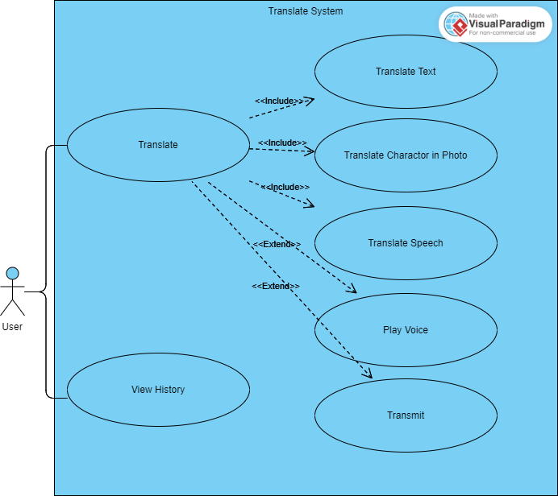
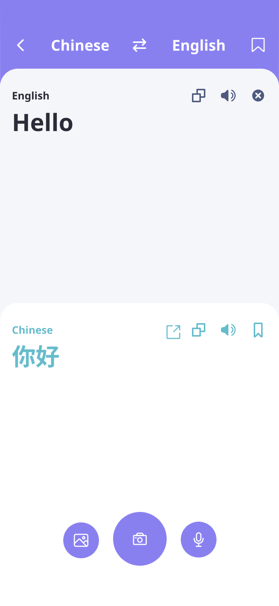
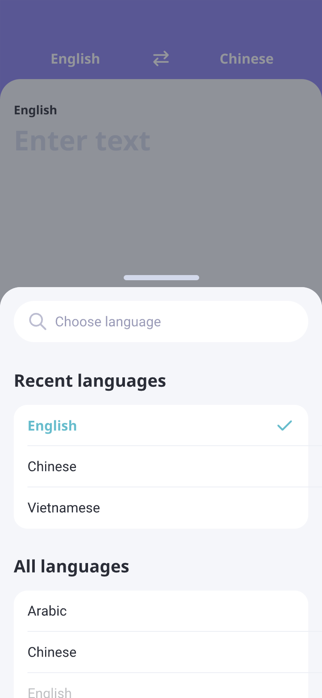
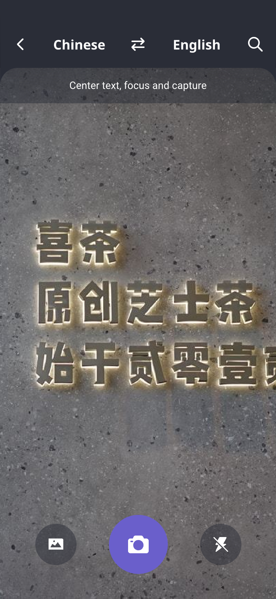
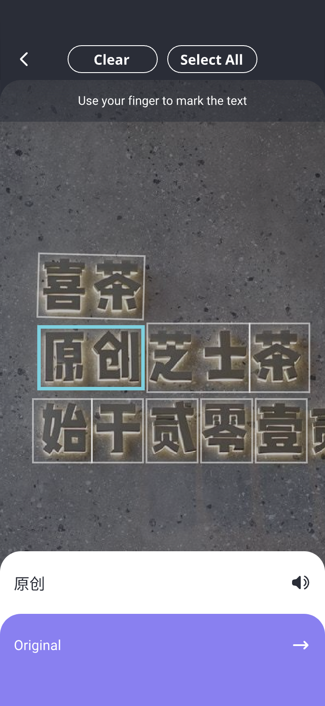
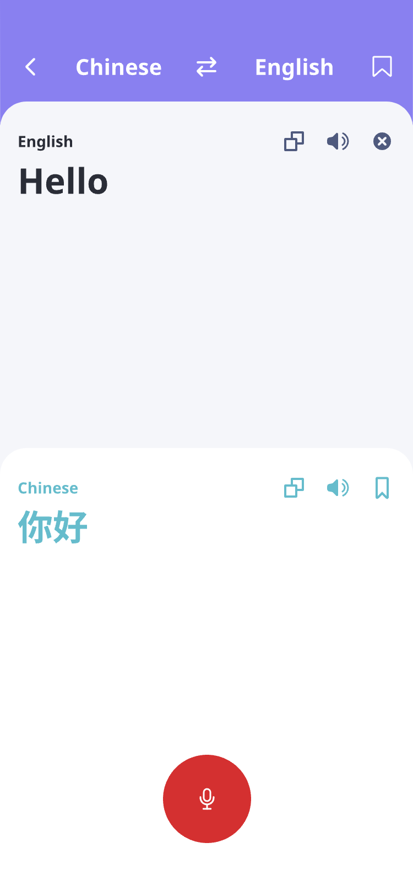

# 需求描述

---

## 功能性描述

### 用户需求

<figure>
    
    <figcaption style="text-align: center; color: gray">用例图</figcaption>
</figure>

1. **文本翻译 (Translate Text)**  
   用户选择翻译语言和目标语言，在输入框中输入文字，在输出框中获得翻译后的目标语言文本。
2. **图片翻译 (Translate Character in Photo)**
   用户选择翻译语言和目标语言，上传照片或拍摄照片，获得文字识别结果和翻译结果，并可对文字识别结果进行进行编辑,获得新的翻译结果。
3. **语音翻译 (Translate Speech)**
   用户选择翻译语言和目标语言，录入待翻译的音频内容，获得翻译结果，并可对语音识别结果进行编辑，获得新的翻译结果。
4. **目标语言语音播放 (Play Voice)**  
   对于所有翻译结果，用户能够播放语音朗读结果，获得语言信息。
5. **历史查看 (View History)**  
   用户可在翻译主界面右上角找到历史翻译记录的入口，点击会进入历史记录页面，可以查看自己的历史记录。
6. **转发到微信和 QQ (Transmit)**  
   用户可以将翻译结果通过翻译页面的转发按钮，转发到微信和 QQ。

### 系统需求

#### 语音合成功能

1. **初始假设**
   用户希望通过语音的形式来输出翻译内容，系统需要进行语音合成功能，将文本转换为语音，再通过扬声器播放。
2. **正常状态**
   翻译结果呈现在结果框中后，点击语音输出按钮，系统开始进行语音合成并将翻译结果以语音的形式进行输出。
3. **异常情况**
   - 系统语音合成功能出现故障，无法将文本正确转换为语音。
   - 扬声器或音频设备出现故障，无法正常播放语音。
4. **其他活动**
   用户首次点击播放按钮，语音播放过程中，对按钮进行锁定，防止快速点击按钮引起音频重叠播放
5. **系统完成状态**
   用户可以通过语音输出翻译内容，系统可以将文本转换为语音，并通过扬声器播放出来。

#### 文本翻译功能

1. **初始假设**  
   翻译框中的文字是需要翻译的内容，翻译语言和目标语言由用户选择，在翻译结果框中显示翻译后的内容。
2. **界面原型**
   
<figure>

<figcaption style="text-align: center;color: gray">文本翻译</figcaption>

</figure>

<figure>
    
    <figcaption style="text-align: center; color: gray">选择翻译语言</figcaption>
</figure>

3. **正常状态**
   - 用户在可编辑翻译框中的内容，系统自动完成语言识别，用户选择翻译的目标语言
   - 用户可以手动选择翻译文本的语言
4. **异常情况**
   - 输入的文本中包含无法识别的字符或语言。程序会提示用户重新输入或手动选择语言。
   - 输入的文本过长或复杂，程序无法进行翻译。程序会提示用户缩短输入文本或尝试其他翻译方式。
   - 网络连接不稳定，程序无法进行翻译。程序会提示用户检查网络连接并重试。
5. **其他活动**
   - 用户可以在下拉菜单中选择默认语言，程序会在下一次启动时自动选择该语言。
   - 程序会记录用户的翻译历史，用户可在历史记录中查看以前的翻译结果。
   - 系统提供翻译结果的复制，转发以及朗读功能
6. **系统完成状态**
   - 用户可编辑翻译框，程序自动检测输入语言，用户可在翻译语言菜单中选择相应的目标语言。
   - 翻译为目标语言后的翻译结果呈现在结果框中。
   - 翻译被记录
   - 翻译结果可翻译，复制并播放语音朗读结果

#### 图像翻译功能

1. **初始假设**  
   系统提供图像翻译功能，用户可以通过拍照或上传照片提供图像，系统识别出图片中的待翻译文本，再使用文本翻译完成目标语言翻译任务。
2. **界面原型**
   
<figure>
    
    <figcaption style="text-align: center; color: gray">图像翻译</figcaption>
</figure>

<figure>
    
    <figcaption style="text-align: center; color: gray">图像编辑——选择翻译部分</figcaption>
</figure>

3. **正常状态**
   - 用户打开 app，点击拍照按钮，可拍摄照片进行翻译，或点击相册按钮，可选择照片进行翻译。进入图片编辑界面后，用户可以选择整张图片或者框选图片中需要翻译的部分，用户需要选择待翻译的语言种类和目标语言种类。检测到用户按下翻译按钮时，系统应该调用 OCR 服务对目标图片进行文字识别，识别结果在文本翻译框中显示，进行文本翻译。
   - 系统应该允许用户在翻译后重新选择图片，重新选择翻译语言并进行翻译。
4. **异常情况**
   - 系统权限不足，无法访问用户图库。
   - OCR 功能出现故障，导致无法完成文字识别。
5. **系统完成状态**
   用户可以通过 OCR 功能成功识别图片中的文字并进行翻译。

#### 语音翻译功能

1. **初始假设**
   用户可以通过语音输入翻译的音频素材，系统需要进行语音识别功能，将语音转换为文本，再使用文本翻译完成目标语言翻译任务。
2. **界面原型**
   
<figure>
    
    <figcaption style="text-align: center; color: gray">图像编辑——选择翻译部分</figcaption>
</figure>

3. **正常状态**
   - 用户点击语音输入按钮，系统开始录音并将录音转换为文本格式，并输出到翻译框中。
   - 系统使用文本翻译功能进行翻译和呈现。
4. **异常情况**
   - 语音输入的质量不好，无法被识别成文本。系统应该提示用户录音质量不好，请重试。
   - 翻译服务不可用或异常。系统应该提示用户翻译服务暂时不可用，请稍后再试。
5. **系统完成的状态**
   - 用户可以通过语音输入方式进行翻译操作。
   - 系统可以对语音进行识别并将其转换为文本格式。
   - 系统使用文本翻译功能进行翻译，呈现结果。

## 非功能性需求

---

1. **性能需求**
   - 翻译响应时间： 对于用户输入的文本，系统应在 1 秒内返回翻译结果，确保快速响应用户需求。
   - OCR 识别和语音识别处理时间： 对于用户上传的图片或音频，系统应在 5 秒内完成识别并返回结果，支持各种文件格式的快速处理。
   - 高并发请求支持：系统应能够支持至少 10,000 并发用户请求，即使在用户量剧增的情况下，系统的性能不会显著下降。
2. **安全性需求**
   - 数据保护： 用户的个人信息和使用数据应通过加密存储和传输，严格遵守 GDPR 等国际数据保护法规，确保数据不会被未授权的第三方访问或泄露。
   - 抵抗恶意攻击： 系统应具备多层次的安全防护措施，包括但不限于防止 DDoS 攻击、SQL 注入和跨站脚本攻击（XSS），定期进行安全漏洞扫描和修复。
3. **可用性需求**
   - 系统可用性： 系统的正常运行时间应达到 99.9%，通过冗余部署和故障转移机制保证服务持续可用。
   - 快速恢复： 在出现系统故障时，应能在 1 小时内恢复至正常运营状态，确保最小的服务中断。
4. **可维护性需求**
   - 模块化和文档化： 系统应设计为模块化结构，配备完整的开发和用户文档，支持快速理解和简便维护。
   - 易于升级： 系统结构应支持无缝集成新的功能和语言包，确保软件的持续发展和技术更新。
5. **可扩展性需求**
   - 扩展架构设计： 系统架构应设计为可扩展性强的框架，支持未来增加更多功能如多语言支持、实时语音翻译、图像翻译等。
6. **用户体验需求**
   - 用户界面设计： 系统界面应简洁直观，支持用户快速上手，无需复杂的培训即可使用基本功能。
   - 用户反馈机制： 系统应提供易于访问的用户反馈渠道，包括错误报告和功能建议，以便持续改进用户体验。
