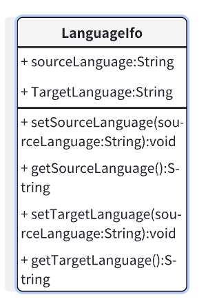
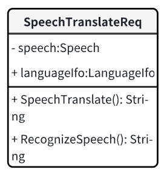

# 接口设计

## 语言设置接口

<figure>
    
    <figcaption style="text-align: center; color: gray">语言设置接口</figcaption>
</figure>

`sourceLanguage`: 翻译源语言  
`TargetLanguage`: 翻译目标语言  
`setSourceLanguage(sourceLanguage: String): void`: 设置源语言。
`getSourceLanguage(): String`: 获取源语言。
`setTargetLanguage(targetLanguage: String): void`: 设置目标语言。
`getTargetLanguage(): String`: 获取目标语言。

## 文本翻译接口

<figure>
    
    <figcaption style="text-align: center; color: gray">文本翻译接口</figcaption>
</figure>

`Text`: 待翻译文本  
`languageIfo`: 翻译语言信息  
`TextTranslate():String`: 把文本翻译成目标语言

## OCR 图片翻译接口

<figure>
    
    <figcaption style="text-align: center; color: gray">文本翻译接口</figcaption>
</figure>

`image`: 图像数据  
`languageIfo`: 翻译语言信息  
`RecognizeImage():String`: 将图片内容识别成文字文本  
`OCRTranslage():String`: 将图片中识别后选中的内容翻译成文本

## 语音翻译接口

<figure>
    
    <figcaption style="text-align: center; color: gray">文本翻译接口</figcaption>
</figure>

`speech`: 语音数据  
`languageIfo`: 翻译语言信息  
`RecognizeSpeech():String` : 将语音内容识别成文字文本  
`SpeechTranslate():String`: 将语音识别的内容翻译成文本
