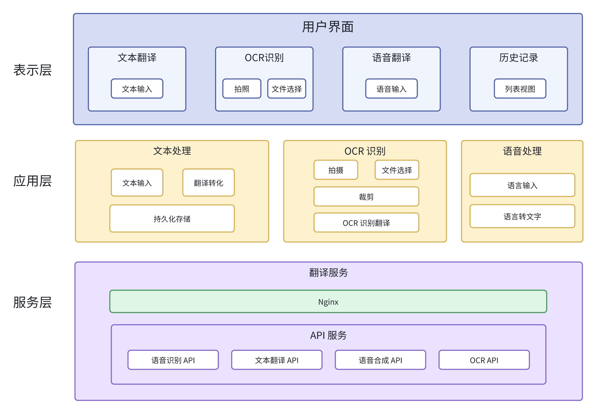

## 架构设计

我们的翻译软件的系统架构主要采用**分层模式** (Layered pattern) 和 **客户端／服务器模式** (Client-server pattern)实现, 架构图如下：

<figure>

<figcaption style="text-align: center;color: gray">系统架构图</figcaption>

### 表示层 (Presentation Layer)

表示层是用户与系统交互的界面，主要在客户端实现，包括用户界面、数据输入、输出等。这一层负责收集用户的输入（包括文本、语音和图像）并将请求发送到服务器。同时，它接收服务器返回的处理结果，并展示给用户。在我们的翻译软件中，表示层具体包括：

- 用户输入文本的界面
- 显示翻译结果的界面
- OCR 识别翻译的界面
- 语音识别翻译的界面
- 历史翻译记录查询的界面

表示层采用的是 React Native 跨端框架进行开发，确保用户界面友好且响应迅速。

### 应用层 (Application Layer)

应用层在我们的翻译软件架构中是核心层，它被细分为前端和后端两个部分，各自承担不同的职责以高效处理用户的需求。

#### 前端应用层

前端应用层使用 **`React Native`** 的 **`Expo`** 框架进行开发，负责构建跨平台的移动应用界面。它直接与用户交互，处理用户输入、展示翻译结果，并管理应用的状态。主要职责包括：

- **用户界面呈现**：构建和维护用户界面，包括输入文本的界面、显示翻译结果的界面、以及语音和图像输入选项。
- **用户输入处理**：接收用户的手动输入、语音输入及图像上传，并将这些数据发送到服务器端应用层处理。
- **状态管理**：使用 `Expo` 框架的状态管理功能，如 `React Context API` ，管理应用状态，如用户的登录状态、语言设置、历史记录等。
- **与服务端通信**：通过 `HTTP/HTTPS API` 调用与服务器端应用层交互，提交待翻译数据，并接收翻译结果及其他响应。

#### 后端应用层

后端应用层部署在服务器上，负责处理复杂的业务逻辑，如文本翻译、语音识别和语音合成。它接收来自前端的请求，执行必要的处理，并返回结果。具体职责包括：

- **请求处理**：解析来自前端的请求，包括用户的文本、语音文件和图像数据。
- **业务逻辑执行**：实施翻译算法，调用 OCR 和语音识别服务，以及语音合成技术，处理用户请求。
- **与服务层交互**：调用服务层提供的数据访问和外部 API 服务，如对象存储和第三方翻译服务。
- **结果输出**：将处理结果（文本翻译、语音文件）封装成响应，发送回前端应用层。

### 服务层 (Service Layer)

服务层在我们的翻译软件中起着至关重要的基础技术支持角色，位于服务器端，主要负责执行与外部服务的接口调用及管理数据和资源的存储。该层确保应用层能够专注于业务逻辑的处理，而不需直接处理复杂的数据管理或与外部系统的直接交互。具体功能包括：

- **调用外部翻译接口**：与第三方翻译服务提供商接口交互，获取精准的翻译结果。这包括支持多语言翻译和实时翻译功能。
- **调用 OCR 接口**：利用光学字符识别技术，从用户上传的图像中提取文本，用于后续的翻译处理。
- **调用语音合成 API**：将翻译得到的文本转换成语音输出，为用户提供听觉反馈，特别是对于视觉障碍用户的辅助功能。
- **资源管理**：管理服务器端的文件存储和数据备份，包括音频文件的存储和调取，确保数据的持久化和高可用性。
